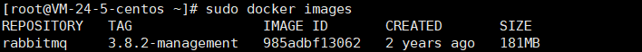

# CentOS8.2-Docker-RqbbitMQ

1、下载`RabbitMQ`镜像，`management`版本自带`web`管理页面

```shell
sudo docker pull rabbitmq:3.8.2-management
```

2、查看镜像

```shell
sudo docker images
```



3、启动`Docker`容器

```shell
#方式二：设置用户名和密码
# 账户：admin
# 密码：W6vSN.6j:OT8
docker run -d --hostname rabbit --restart=always --name rabbit -e RABBITMQ_DEFAULT_USER=admin -e RABBITMQ_DEFAULT_PASS=W6vSN.6j:OT8 -p 15672:15672 -p 5672:5672 rabbitmq:3.8.2-management
```

4、查看当前运行的容器

```shell
sudo docker ps
```

5、与`Docker`绑定生命周期

```shell
sudo docker container update --restart=always 容器ID
```

6、访问控制台

[RabbitMQ Management](http://81.70.96.232:15672/#/)

7、`Docker`相关操作

```shell
# 停止容器
sudo docker stop 容器ID
# 启动容器
sudo docker start 容器ID
# 删除容器
sudo docker rm 容器ID
```


## 相关地址

[Centos8下使用docker安装RabbitMQ | 航行学园 (voycn.com)](http://www.voycn.com/article/centos8xiashiyongdockeranzhuangrabbitmq)


