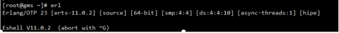
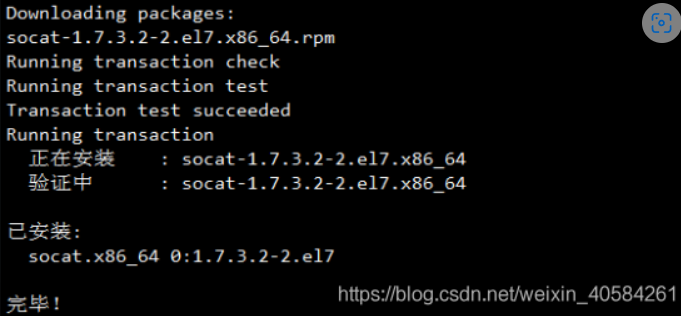

## 环境变量配置

`erlang`前置条件配置

```shell
curl -s https://packagecloud.io/install/repositories/rabbitmq/erlang/script.rpm.sh | sudo bash
```

安装`erlang`

```shell
yum install -y erlang
```

检查`erlang`的版本号

```shell
erl
```



`RabbitMQ`前置环境变量设置

```shell
rpm --import https://packagecloud.io/rabbitmq/rabbitmq-server/gpgkey
rpm --import https://packagecloud.io/gpg.key
rpm --import https://www.rabbitmq.com/rabbitmq-release-signing-key.asc
yum -y install epel-release
yum -y install socat
```




## `RabbitMQ`安装

`RabbitMQ`前置条件配置

```shell
curl -s https://packagecloud.io/install/repositories/rabbitmq/rabbitmq-server/script.rpm.sh | sudo bash
```

下载`rabbitmq`安装包（`onedrive`开发目录有文件）

```http
https://github.com/rabbitmq/rabbitmq-server/releases/download/v3.8.5/rabbitmq-server-3.8.5-1.el7.noarch.rpm
```

安装`RabbitMQ`

```shell
rpm -ivh rabbitmq-server-3.8.5-1.el7.noarch.rpm
```

启用管理平台插件，启用插件后，可以可视化管理`RabbitMQ`

```shell
rabbitmq-plugins enable rabbitmq_management
```

启动`RabbitMQ`

```shell
systemctl start rabbitmq-server
```

设置开机自启

```shell
vim /etc/systemd/system/rabbitmq.service
```

插入下方内容

```
[Unit]
#服务描述
Description=rabbitmq Server Manager
#服务类别
After=syslog.target network.target

[Service]
Type=forking
User=root
Group=root
WorkingDirectory=/usr/lib/rabbitmq/lib/rabbitmq_server-3.8.5
ExecStart=/usr/lib/rabbitmq/lib/rabbitmq_server-3.8.5/sbin/rabbitmq-server -detached
ExecReload=/usr/lib/rabbitmq/lib/rabbitmq_server-3.8.5/sbin/rabbitmqctl stop
ExecStop=/usr/lib/rabbitmq/lib/rabbitmq_server-3.8.5/sbin/rabbitmqctl stop
#给服务分配独立的临时空间
PrivateTmp=true

[Install]
#运行级别下服务安装的相关设置，可设置为多用户，即系统运行级别为3
WantedBy=multi-user.target
```

常用命令

```shell
#启动redis服务
systemctl start rabbitmq.service
#设置开机自启动
systemctl enable rabbitmq.service
#停止开机自启动
systemctl disable rabbitmq.service
#查看服务当前状态
systemctl status rabbitmq.service
#重新启动服务
systemctl restart rabbitmq.service
#查看所有已启动的服务
systemctl list-units --type=service
```


## `RabbitMQ-WEB`管理端

创建用户名`admin`，密码`W6vSN.6j:OT8`的用户

```shell
rabbitmqctl add_user admin W6vSN.6j:OT8
```

设置`admin`为超级管理员

```shell
rabbitmqctl set_user_tags admin administrator
```

授权远程访问（也可以登录后，可视化配置）

```shell
rabbitmqctl set_permissions -p / admin "." "." ".*"
```

创建完成后，重启`RabbitMQ`

```shell
systemctl restart rabbitmq-server
```

`web`网址

```shell
http://192.168.10.88:15672
```


## `RabbitMQ-Plugins`插件

找到插件目录

```shell
cd /usr/lib/rabbitmq/lib/rabbitmq_server-3.8.5/plugins
```

下载插件`rabbitmq_delayed_message_exchange-3.8.0.ez`，上传文件到插件目录

```shell
https://github.com/rabbitmq/rabbitmq-delayed-message-exchange/releases/tag/v3.8.0
```

启用插件

```shell
rabbitmq-plugins enable rabbitmq_delayed_message_exchange
```

重启`RabbitMQ`

```shell
systemctl restart rabbitmq-server
```


## 参考文章

[Centos7安装RabbitMQ最新版3.8.5，史上最简单实用安装步骤_centos7 rabbitmq3.8.5安装-CSDN博客](https://blog.csdn.net/weixin_40584261/article/details/106826044)

[【RabbitMQ】一文带你搞定RabbitMQ延迟队列 - 弗兰克的猫 - 博客园 (cnblogs.com)](https://www.cnblogs.com/mfrank/p/11260355.html)


