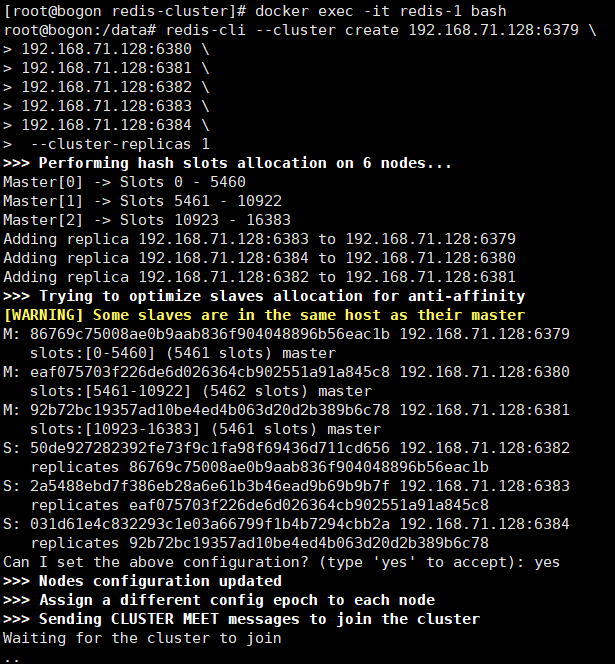
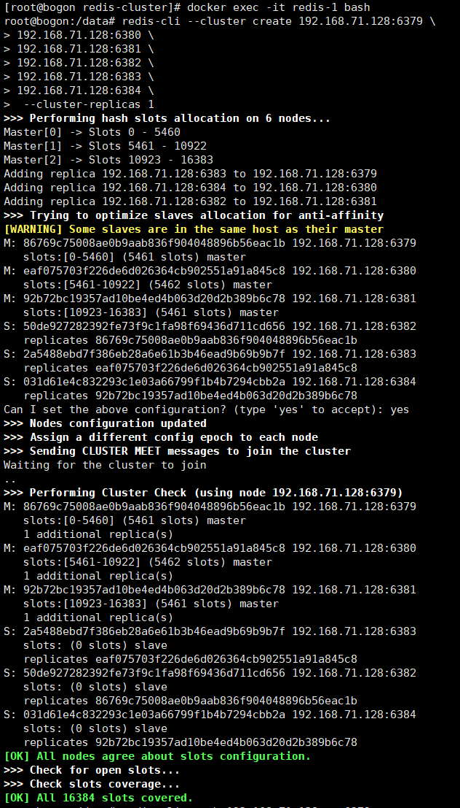
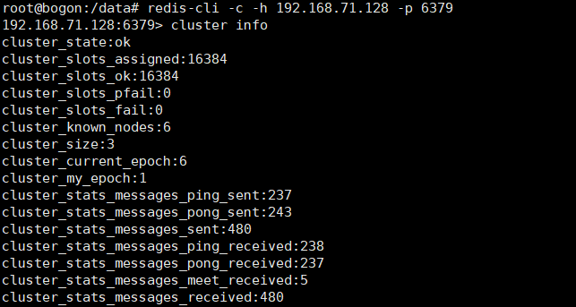

本文地址：[基于docker-compose搭建redis集群_BuBu高打火机的博客-CSDN博客](https://blog.csdn.net/fd214333890/article/details/111007824)


## 现在`Redis`镜像

```shell
docker pull redis:6.0.4
```


## 创建相关目录、配置文件

1.   创建文件目录

     ```shell
     # 创建/root/redis-cluster目录
     mkdir -p /root/redis-cluster
     ```

2.   创建容器目录

     ```shell
     # 创建redis-1~redis-6文件夹
     mkdir /root/redis-cluster/redis-1 \
     /root/redis-cluster/redis-2 \
     /root/redis-cluster/redis-3 \
     /root/redis-cluster/redis-4 \
     /root/redis-cluster/redis-5 \
     /root/redis-cluster/redis-6
     ```

3.   每个`redis-*`文件夹下创建`redis.conf`文件，并写入如下内容。

     ```conf
     # 开启集群
     cluster-enabled yes
     # 集群配置文件
     cluster-config-file nodes.conf
     # 集群节点多少时间未响应视为该节点丢失
     cluster-node-timeout 5000
     appendonly yes
     # 账户密码
     masterauth tianqihang
     requirepass Tian962454294
     # 关闭保护模式
     protected-mode no
     # redis监听端口
     port 6379
     ```

     **注意：`port`值不能都为`6379`，根据上面`redis`列表设置的端口号，依次给`redis-1` ~ `redis-6`设置`6379~6384`端口号**

4.   编写`docker-compose.yml`文件，**直接复制会有问题，建议在`win`创建好文件后，粘贴进指定位置。**

     ```shell
     version: '3.1'
     services:
       # redis1配置
       redis1:
         image: daocloud.io/library/redis:6.0.4
         container_name: redis-1
         restart: always
         environment:
          - REDISCLI_AUTH=Tian962454294
         network_mode: "host"
         volumes:
           - ./redis-1/redis.conf:/usr/local/etc/redis/redis.conf
         command: ["redis-server", "/usr/local/etc/redis/redis.conf"]
       # redis2配置
       redis2:
         image: daocloud.io/library/redis:6.0.4
         container_name: redis-2
         restart: always
         environment:
          - REDISCLI_AUTH=Tian962454294
         network_mode: "host"
         volumes:
           - ./redis-2/redis.conf:/usr/local/etc/redis/redis.conf
         command: ["redis-server", "/usr/local/etc/redis/redis.conf"]
       # redis3配置
       redis3:
         image: daocloud.io/library/redis:6.0.4
         container_name: redis-3
         restart: always
         environment:
          - REDISCLI_AUTH=Tian962454294
         network_mode: "host"
         volumes:
           - ./redis-3/redis.conf:/usr/local/etc/redis/redis.conf
         command: ["redis-server", "/usr/local/etc/redis/redis.conf"]
       # redis4配置
       redis4:
         image: daocloud.io/library/redis:6.0.4
         container_name: redis-4
         restart: always
         environment:
          - REDISCLI_AUTH=Tian962454294
         network_mode: "host"
         volumes:
           - ./redis-4/redis.conf:/usr/local/etc/redis/redis.conf
         command: ["redis-server", "/usr/local/etc/redis/redis.conf"]
       # redis5配置
       redis5:
         image: daocloud.io/library/redis:6.0.4
         container_name: redis-5
         restart: always
         environment:
          - REDISCLI_AUTH=Tian962454294
         network_mode: "host"
         volumes:
           - ./redis-5/redis.conf:/usr/local/etc/redis/redis.conf
         command: ["redis-server", "/usr/local/etc/redis/redis.conf"]
       # redis6配置
       redis6:
         image: daocloud.io/library/redis:6.0.4
         container_name: redis-6
         restart: always
         environment:
          - REDISCLI_AUTH=Tian962454294
         network_mode: "host"
         volumes:
           - ./redis-6/redis.conf:/usr/local/etc/redis/redis.conf
         command: ["redis-server", "/usr/local/etc/redis/redis.conf"]
     ```


## 运行容器

1.   在`/root/redis-cluster`文件夹下，执行如下命令，启动`redis`容器。

     ```shell
     docker-compose up -d
     ```

2.   查看容器状态

     ```shell
     docker ps
     ```

     

3.   开启集群

     ```shell
     # 进入容器内部
     docker exec -it redis-1 bash
     # 创建redis集群
     redis-cli --cluster create IP:6379 \
     IP:6380 \
     IP:6381 \
     IP:6382 \
     IP:6383 \
     IP:6384 \
     --cluster-replicas 1
     ```

     会出现如下图所示，此时输入`yes`即可

     

     出现下图即为成功

     


## 测试

使用`redis-cli`命令，连接集群中任意节点。（随便找一台能ping通集群所在`IP`的电脑）

1.   连接节点

     ```shell
     redis-cli -c -h IP -p prot -a 密码
     ```

2.   查看集群状态

     ```shell
     cluster info
     ```

     显示如下图所示即为集群状态健康

     

     

3.   查看节点信息

     ```shell
     cluster nodes
     ```

     显示如图所示

     

     注意看图中的`slave`,`master`,`myself`等关键字。

     | 关键字 | 说明                   |
     | ------ | ---------------------- |
     | slave  | 该节点为备份节点       |
     | master | 该节点为主节点         |
     | myself | 该节点为当前连接的节点 |

     

4.   `api`测试

     ```shell
     set test 'hello world'
     get test
     ```

     **注意：这里根据切片自动切换到了该数据分片所在的节点上，所以下面可以看到连接的节点变为了`192.168.71.128:6380`**

     


## 客户端`AnotherRedisDesktopManager`连接可能出现的错误


1.   集群链接时报错：`Redis Client On Error: Failed to refresh slots cache. Config right?`

     解决办法：不用输入用户名，只需要密码就可以了

2.   单机链接时报错：`Redis Client On Error: ReplyError: WRONGPASS invalid username-password pair or user is disabled.`

     解决办法：不用输入用户名，只需要密码就可以了

3.   
